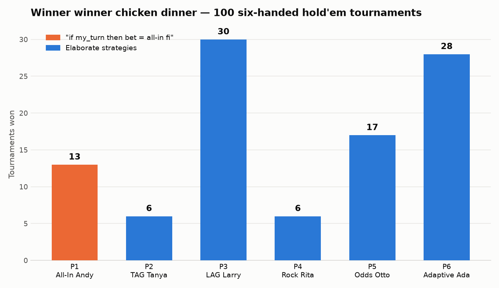

# holdem-showdown

Six bots. One table. Equal stacks. A hundred sit-and-go tournaments to a single
survivor. Five of the bots run elaborate no-limit hold'em strategies. One runs
this:

```
if my_turn
    then bet = All in
fi
```

No bot knows any other bot's strategy — they only see public actions at the
table (bets, raises, folds, showdowns).

## The lineup

| Seat | Bot | Strategy |
|------|-----|----------|
| P1 | **All-In Andy** | Shoves every stack, every hand, forever. That's it. That's the algorithm. |
| P2 | **TAG Tanya** | Tight-aggressive: positional Chen-formula opening ranges, 3-bets premiums, pot-odds discipline postflop, push/fold when short. |
| P3 | **LAG Larry** | Loose-aggressive: opens wide, 3-bet bluffs, barrels when checked to, semi-bluffs draws, folds only when the math is clearly bad. |
| P4 | **Rock Rita** | Ultra-tight nit: premiums only, never bluffs, folds to aggression without a monster, stacks off only near the nuts. |
| P5 | **Odds Otto** | Pure EV machine: Monte Carlo equity vs required pot odds on every decision. Never bluffs, never folds a +EV call. |
| P6 | **Adaptive Ada** | Exploiter: tracks each opponent's aggression frequency across the tournament and re-prices their bets — a serial shover's all-in is treated as a random hand, a nit's raise as the top of the deck. |

## The engine

Full no-limit Texas Hold'em: real 7-card hand evaluation, blinds (10/20,
doubling every 12 hands), min-raise tracking, split pots, side pots for
multiway all-ins, uncalled-bet refunds, button rotation, heads-up blind rules,
and a chip-conservation check after every hand. One known simplification: an
all-in under-raise re-opens action for players who already acted (real rules
only let them call).

Strategies see a `View` of public information plus their own hole cards, and
return `fold` / `check` / `call` / `raise`. Equity estimates are Monte Carlo
rollouts against random hands — nobody gets to peek.

## Run it

```
pip install matplotlib   # optional, for the PNG; use --no-plot without it
python3 holdem.py --sims 100 --seed 42 --out results
```

Deterministic for a given `--seed`.

## Results (100 tournaments, seed 42)

```
P1 All-In Andy         ████████████████████ 13
P2 TAG Tanya           █████████ 6
P3 LAG Larry           ██████████████████████████████████████████████ 30
P4 Rock Rita           █████████ 6
P5 Odds Otto           ██████████████████████████ 17
P6 Adaptive Ada        ███████████████████████████████████████████ 28

player                  wins  avg finish  best  worst
P1 All-In Andy            13        4.87     1      6
P2 TAG Tanya               6        2.90     1      5
P3 LAG Larry              30        3.09     1      6
P4 Rock Rita               6        2.85     1      6
P5 Odds Otto              17        3.86     1      6
P6 Adaptive Ada           28        3.43     1      6
```



### What happened

- **Andy is not a joke.** 13 outright wins from pure chaos — every hand he
  forces the table into a coin flip for stacks, and sometimes he just keeps
  winning them. But his average finish (4.87 of 6) is by far the worst:
  variance giveth 13 trophies and taketh away everything else.
- **Aggression wins tournaments.** LAG Larry (30) and Adaptive Ada (28) took
  the most titles. Escalating blinds punish patience; Larry accumulates chips
  nobody contests, and Ada figures out within a few orbits that Andy's shove
  means nothing and calls him off light.
- **Tight is right… for cashing, not winning.** Tanya and Rita post the best
  average finishes (2.90, 2.85) — they outlast the field beautifully — then
  arrive at the endgame short-stacked and win it only 6 times each. Surviving
  is not the same as winning.
