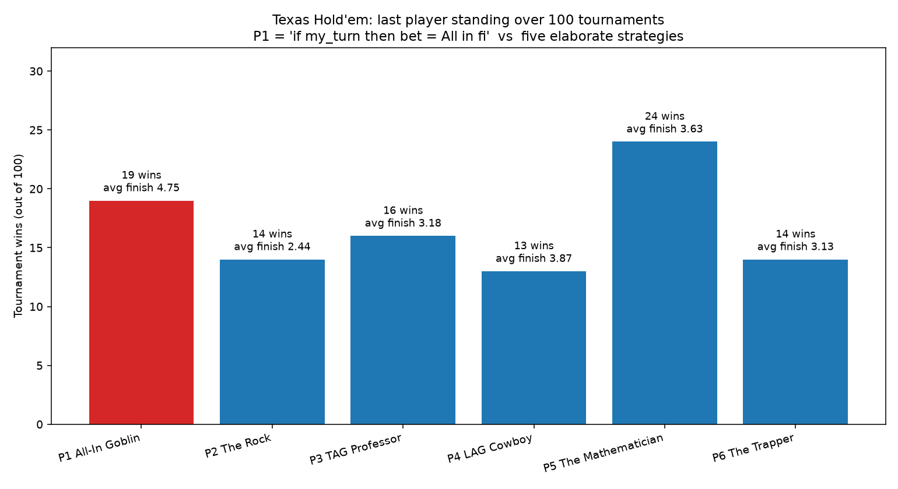

# holdem-sim — 6-max No-Limit Texas Hold'em tournament simulator

Six players, equal starting stacks (1000 chips), blinds 10/20 doubling every
15 hands, freezeout: play until one player holds every chip. No strategy can
see any other strategy's code, holdings, or intentions — each one receives
only a legal-information observation (own hole cards, board, pot, stacks,
position, action so far).

## The lineup

| Seat | Strategy | Idea |
|------|----------|------|
| P1 | **All-In Goblin** | The entire algorithm: `if my_turn then bet = All in fi` |
| P2 | **The Rock** | Ultra-tight nit. Folds ~93% of hands, stacks off with premiums only |
| P3 | **TAG Professor** | Position-aware tight-aggressive, pot-odds discipline, c-bets |
| P4 | **LAG Cowboy** | Loose-aggressive: wide opens, semi-bluffs, randomized pure bluffs |
| P5 | **The Mathematician** | No reads, no bluffs: pure Monte-Carlo equity vs pot odds, every street |
| P6 | **The Trapper** | Slow-plays monsters, springs check-raises, fit-or-fold otherwise |

The engine supports full betting rounds, min-raise rules, all-ins and side
pots, uncalled-bet refunds, heads-up blind rules, and asserts chip
conservation after every hand.

## Run it

```bash
pip install matplotlib   # optional, for the PNG histogram
python3 simulate.py --sims 100 --seed 42
```

## Results (100 tournaments, seed 42)

```
WINNER WINNER CHICKEN DINNER — tournament wins out of 100
==============================================================
P1 All-In Goblin       | ████████████████████████████████          19  (19%)
P2 The Rock            | ███████████████████████                   14  (14%)
P3 TAG Professor       | ███████████████████████████               16  (16%)
P4 LAG Cowboy          | ██████████████████████                    13  (13%)
P5 The Mathematician   | ████████████████████████████████████████  24  (24%)
P6 The Trapper         | ███████████████████████                   14  (14%)
==============================================================

Average finishing place (1 = winner, 6 = first out):
  P1 All-In Goblin       4.75   <- worst at the table
  P2 The Rock            2.44   <- best survivor
  P3 TAG Professor       3.18
  P4 LAG Cowboy          3.87
  P5 The Mathematician   3.63
  P6 The Trapper         3.13
```



## What it means

The All-In Goblin is pure variance: it steals blinds relentlessly and forces
everyone to play flip-or-fold poker, so it either snowballs to victory (19%
of the time — barely above the 16.7% random baseline) or busts early and
often (worst average finish, 4.75). The Mathematician's bluff-free
equity-vs-pot-odds play is the most reliable champion, and The Rock almost
never busts early but folds its way out of enough chips that survival alone
doesn't convert into titles. In a winner-take-all freezeout, shoving every
hand is not even a losing strategy — but in any real game with more than one
payout place, an average finish of 4.75 is a catastrophe.
