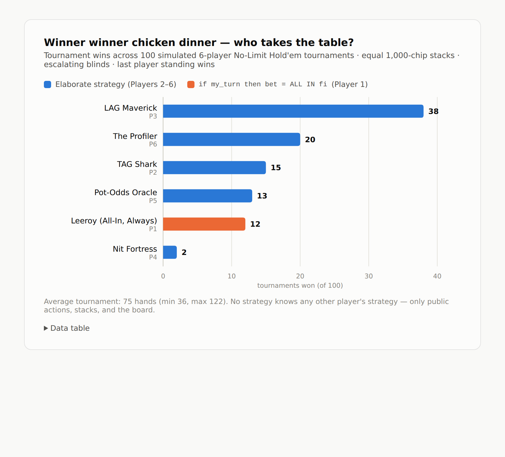

# Hold'em Strategy Thunderdome

100 full No-Limit Texas Hold'em tournaments. Six players, equal 1,000-chip
stacks, escalating blinds, last player standing takes the chicken dinner.
No player knows any other player's strategy — only public actions, stacks,
and the board.

## The contestants

| Seat | Strategy | Idea |
|------|----------|------|
| P1 | **Leeroy (All-In, Always)** | The entire algorithm: `if my_turn then bet = ALL IN fi` |
| P2 | **TAG Shark** | Tight-aggressive: Chen-formula preflop ranges by position, c-bets with equity, Monte Carlo verification before stack-offs |
| P3 | **LAG Maverick** | Loose-aggressive: wide opens, light 3-bets, semi-bluffs every draw, randomized stabs at orphan pots |
| P4 | **Nit Fortress** | Ultra-tight premium hunter: folds everything but the top of the deck, then plays for stacks |
| P5 | **Pot-Odds Oracle** | Pure mathematician: Monte Carlo equity vs. exact pot odds on every decision |
| P6 | **The Profiler** | Adaptive exploiter: profiles opponents' raise/shove/fold frequencies from public actions and adjusts its ranges against each one |

## Results (100 tournaments, seed 42)

```
P1 Leeroy (All-In, Always)  █████████████                             12  (12%)
P2 TAG Shark                ████████████████                          15  (15%)
P3 LAG Maverick             ████████████████████████████████████████  38  (38%)
P4 Nit Fortress             ██                                         2  (2%)
P5 Pot-Odds Oracle          ██████████████                            13  (13%)
P6 The Profiler             █████████████████████                     20  (20%)
```



Average tournament: 75 hands (min 36, max 122).

## What happened

- **LAG Maverick (38%)** crushed it. Relentless, calculated aggression wins
  tournaments with escalating blinds: it accumulates chips while others wait,
  and it gets honest (equity math) exactly when stacks go in.
- **The Profiler (20%)** finished second by doing the one thing nobody else
  does: noticing that P1 shoves literally every hand and calling him wide.
- **Leeroy (12%)** — the six-line bot — beat both the Pot-Odds Oracle's tie
  (13%) region and the Nit outright. Shoving 100% of hands steals a mountain
  of blinds and forces coin flips; sometimes it runs pure for a whole
  tournament. Variance is a hell of a drug.
- **Nit Fortress (2%)** got blinded to dust waiting for aces. Ultra-tight is
  unplayable when blinds double every 15 hands.

## Run it yourself

```bash
python3 holdem.py            # 100 tournaments, seed 42
python3 holdem.py 500 7      # 500 tournaments, seed 7
```

Pure Python 3, no dependencies. The engine implements full NLHE: positional
blinds (heads-up aware), four betting streets with min-raise tracking,
all-ins, and layered side pots (mandatory, since P1 is all-in every hand).
`histogram.html` is a self-contained interactive chart of the results.
