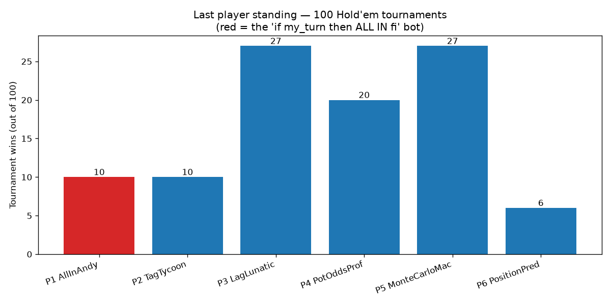

# Hold'em Strategy Deathmatch

No-limit Texas Hold'em tournament simulator. 6 players, 1000 chips each,
blinds 10/20 doubling every 25 hands, side pots and min-raise rules handled
properly. No player knows anyone else's strategy. 100 tournaments, seed 1337.

## The contestants

| Player | Strategy |
|---|---|
| **P1 AllInAndy** | `if my_turn then bet = All in fi` |
| P2 TagTycoon | Tight-aggressive: Chen-formula preflop ranges, position bonus, value-bets 3/4 pot on strong made hands |
| P3 LagLunatic | Loose-aggressive: semi-bluffs flush/straight draws via outs counting, randomized barrel sizing (0.5x/0.8x/1.1x pot), 22% stab frequency |
| P4 PotOddsProf | Pure pot-odds machine: rule of 4-and-2 draw equity vs price, raises only with a 22%+ equity edge |
| P5 MonteCarloMac | Monte Carlo equity rollouts each postflop decision, bets proportional to edge over fair pot share |
| P6 PositionPred | Positional play: steals blinds in late position, tight ranges early, 30% late-position stabs at orphan pots |

## Results (100 tournaments)

```
P1 AllInAndy        10 | ######################
P2 TagTycoon        10 | ######################
P3 LagLunatic       27 | ############################################################
P4 PotOddsProf      20 | ############################################
P5 MonteCarloMac    27 | ############################################################
P6 PositionPred      6 | #############
```



## Run it

```
python3 holdem.py
```
