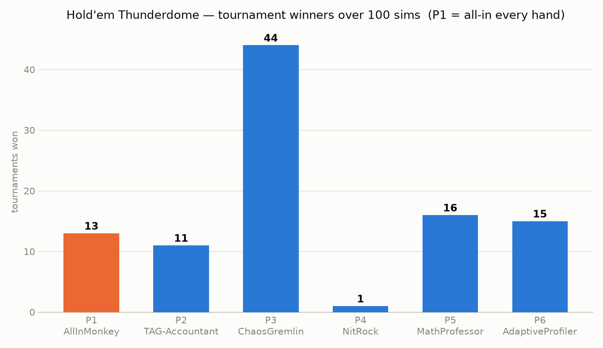

# Hold'em Thunderdome 🃏

6-max No-Limit Texas Hold'em tournament simulator. Six bots, equal starting
stacks (2000 chips, blinds 10/20 doubling every 20 hands), play until one
player owns every chip. No bot knows any other bot's strategy — each one sees
only public information: its own hole cards, the board, stacks, bets, and the
observable action history.

## The lineup

| Seat | Bot | Strategy |
|------|-----|----------|
| P1 | **AllInMonkey** | The entire strategy document of a certain rival chatbot: `if my_turn then bet = All in fi` |
| P2 | **TAG-Accountant** | Tight-aggressive: tiered preflop ranges with position awareness, 3-bet premiums, c-bets, pot-odds-priced draw calls |
| P3 | **ChaosGremlin** | Loose-aggressive: wide ranges, positional blind steals, aggressive semi-bluffs, random barrels, occasional monster traps |
| P4 | **NitRock** | Ultra-tight: plays only premium hands, continues postflop only with top pair or better |
| P5 | **MathProfessor** | Chen-formula preflop; postflop runs Monte Carlo equity rollouts and compares against pot odds every decision |
| P6 | **AdaptiveProfiler** | Exploitative: profiles opponents from observed actions only — widens its calling range vs players it has *seen* open-shoving, steals from tables it has measured as tight |

## Run it

```bash
python3 holdem_sim.py --sims 100 --seed 42 --json results_100.json --plot winners_histogram.png
```

Deterministic per seed. `--verbose` prints each tournament's winner.

## Results (100 tournaments, seed 42)

```
WINNER WINNER CHICKEN DINNER — tournament wins out of 100 sims
==================================================================
P1 AllInMonkey      |█████████████                                 13  (13.0%)
P2 TAG-Accountant   |███████████                                   11  (11.0%)
P3 ChaosGremlin     |████████████████████████████████████████████  44  (44.0%)
P4 NitRock          |█                                              1  ( 1.0%)
P5 MathProfessor    |████████████████                              16  (16.0%)
P6 AdaptiveProfiler |███████████████                               15  (15.0%)
==================================================================

Average finishing position (1 = winner, 6 = first bust):
  P1 AllInMonkey       5.05      P4 NitRock           3.28
  P2 TAG-Accountant    2.99      P5 MathProfessor     4.03
  P3 ChaosGremlin      2.76      P6 AdaptiveProfiler  2.89
```



## Post-game commentary

- **The all-in monkey wins 13%** of tournaments — below the 16.7% a random
  seat would get, and its average finish is a brutal **5.05 / 6** (it busts
  first in most sims). Sometimes the deck runs pure and it steamrolls the
  table; usually somebody wakes up with a real hand and it's a spectator by
  hand 15. Chaos is not a strategy, it's a variance donation program.
- **ChaosGremlin (44%)** feasts: with a maniac at the table, aggressive bots
  that fight for the dead money the monkey leaves behind convert best.
- **NitRock (1%)** proves that folding to the final table is not the same as
  winning it — blinds eat the patient.
- **AdaptiveProfiler** never reads anyone's code: after watching three
  open-shoves it simply starts calling that player wide, which is why the
  monkey's average lifespan is short.

## Engine notes

- Full NLHE: blinds, min-raise tracking, all-ins, **layered side pots**,
  split pots, heads-up blind rules, escalating blind levels.
- 7-card hand evaluator (straight flush → high card, wheel included),
  verified by chip-conservation checks across tournaments.
- Strategies implement `act(view) -> fold | call | raise-to` against a `View`
  containing public info only; a shared `observe()` feed broadcasts every
  public action so bots can profile behavior without seeing code or cards.
