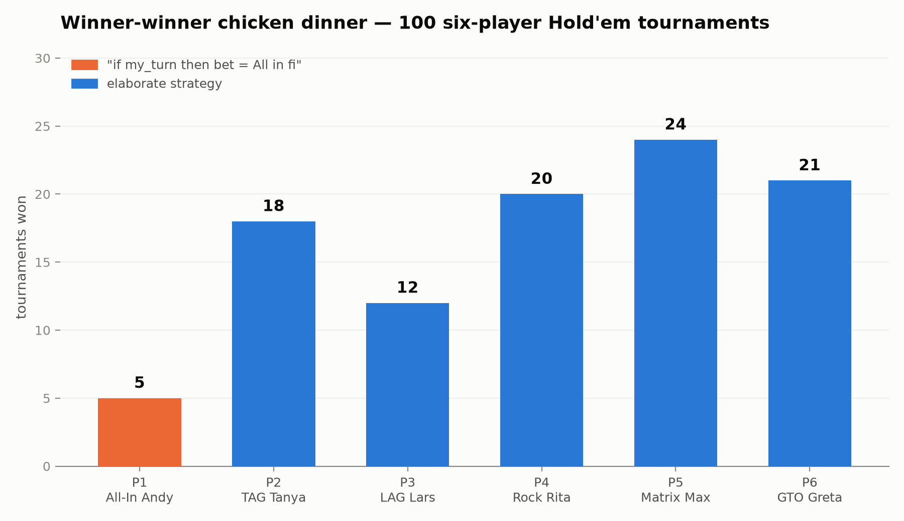

# 🃏 Hold'em Strategy Deathmatch

100 six-player no-limit Texas Hold'em tournaments. Everyone starts with 2,000
chips, blinds escalate every 15 hands, last player standing wins. No strategy
knows any other's algorithm — they only see public table actions.

## The lineup

| Seat | Player | Strategy |
|------|--------|----------|
| P1 | **All-In Andy** | `if my_turn then bet = All in fi` — that's it, that's the algorithm |
| P2 | TAG Tanya | Tight-aggressive: positional Chen-formula ranges, Monte-Carlo equity vs pot odds, semi-bluffs, short-stack push/fold |
| P3 | LAG Lars | Loose-aggressive: wide opens, light 3-bets, barrels scaled to field size, sticky calls |
| P4 | Rock Rita | Ultra-tight nit: premiums only, never bluffs, snap-calls shoves only with real equity |
| P5 | Matrix Max | Adaptive/exploitative: profiles each opponent's VPIP & shove-rate from observed actions, re-prices every call per profile, traps maniacs |
| P6 | GTO Greta | GTO-flavored: randomized mixed strategies, balanced value/bluff ratios, minimum-defense-frequency calls |

## Run it

```bash
python -m holdem.simulate        # 100 tournaments (default)
python -m holdem.simulate 500    # more carnage
```

Outputs an ASCII winner histogram, `results/results.json`, and
`results/winner_histogram.png`.

## Result (seeds 1–100)



```
P1 All-In Andy    5  ← the one-liner
P2 TAG Tanya     18
P3 LAG Lars      12
P4 Rock Rita     20
P5 Matrix Max    24
P6 GTO Greta     21
```

Andy was the **first player eliminated in 67 of 100 tournaments** (average
finish: 5.23 of 6)... and still won 5. Shoving blind into five thinking
players is a 1-in-20 lottery ticket, because the callers still have to win
the flip. The adaptive profiler (Max) took the most dinners — reading the
table beats memorizing a chart.

## Engine notes

- Full no-limit betting: raises, re-raises, min-raise rules, all-in clamping
- Correct side pots via contribution levels + uncalled-bet refunds
- Chip conservation asserted after every tournament
- 7-card hand evaluator, Chen formula preflop scores, Monte-Carlo equity with
  a lazily-built 169-class preflop equity cache
- Deterministic: tournament *i* uses seed *i*
