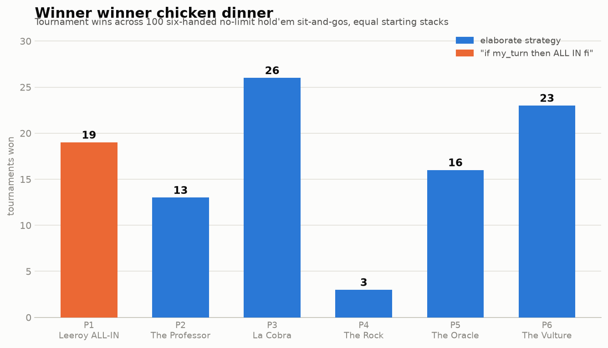

# Winner Winner Chicken Dinner 🐔

A six-handed no-limit Texas Hold'em tournament simulator. Five elaborate
strategy bots sit down against one bot whose entire strategy is:

```
if my_turn
then bet = All in
fi
```

Everyone starts with the same 1000-chip stack, blinds start at 10/20 and
double every 8 hands, and a tournament runs until one player holds every
chip. No bot knows what algorithm any other bot runs — each one only sees
its own hole cards plus public information (board, pot, stacks, action
history), exactly like a human at the table.

## The lineup

| Seat | Player | Strategy |
|------|--------|----------|
| P1 | **Leeroy ALL-IN** | `if my_turn then bet = All in fi`. That's it. That's the whole strategy. |
| P2 | **The Professor** | Textbook tight-aggressive: Chen-formula preflop ranges, made-hand strength vs pot odds postflop, position awareness, push/fold when short. |
| P3 | **La Cobra** | Loose-aggressive: steals wide in position, c-bets relentlessly, semi-bluff-raises flush draws and open-enders, double barrels, random river stabs. |
| P4 | **The Rock** | Ultra-tight: folds ~everything, plays premiums hard, occasionally slow-plays a monster so the tightness isn't perfectly readable. |
| P5 | **The Oracle** | Pure math: Monte Carlo equity vs random hands each decision, compared against pot odds and fair-share thresholds. No reads, no fear, just arithmetic. |
| P6 | **The Vulture** | Exploitative profiler: watches every public action, builds per-opponent aggression stats, calls maniacs down light and bullies the tight. |

## Run it

```bash
python3 -m holdem.simulate            # 100 tournaments, seed 42
python3 -m holdem.simulate 500 7      # 500 tournaments, seed 7
```

Outputs an ASCII histogram, a placement table, `results/results.json`, and
(if matplotlib is installed) `results/winners.png`.

## Results — 100 tournaments, seed 42

```
WINNER WINNER CHICKEN DINNER — tournament wins out of 100
==========================================================================
P1 Leeroy ALL-IN  | █████████████████████████████████████               19  <- the ALL-IN goblin
P2 The Professor  | █████████████████████████                           13
P3 La Cobra       | ██████████████████████████████████████████████████  26
P4 The Rock       | ██████                                               3
P5 The Oracle     | ███████████████████████████████                     16
P6 The Vulture    | ████████████████████████████████████████████        23
==========================================================================

seat player           wins   win %  avg finish
----------------------------------------------
P1   Leeroy ALL-IN      19     19%        4.67
P2   The Professor      13     13%        2.94
P3   La Cobra           26     26%        3.37
P4   The Rock            3      3%        2.84
P5   The Oracle         16     16%        4.03
P6   The Vulture        23     23%        3.15
```



## What the table teaches

- **La Cobra (26) and The Vulture (23) run the table.** Aggression that
  can still fold, and a profiler that learns to call the maniac down
  light, are the two best answers to this lineup.
- **Leeroy finishes above his fair share (19 > 16.7)** — and dead last in
  average finish (4.67). All-in-every-hand is maximum-variance poker: he
  busts early in most tournaments, but when the first few flips connect
  he owns a monster stack that the blinds can't touch. Winner-take-all
  scoring pays him for exactly that boom-or-bust profile.
- **The Rock proves survival ≠ winning**: best average finish (2.84),
  almost no titles (3). Folding your way past the bubble is a great way
  to come 2nd and a terrible way to come 1st once the blinds start
  doubling.

## Layout

```
holdem/
├── cards.py        # deck, 5/6/7-card evaluator, Monte Carlo equity
├── handreading.py  # Chen formula, made-hand strength, draw detection
├── strategies.py   # the six bots
├── engine.py       # betting rounds, side pots, blinds, eliminations
├── chart.py        # matplotlib histogram
└── simulate.py     # tournament runner / CLI entry point
```

Deterministic: same sim count + seed → same winners, card for card.
