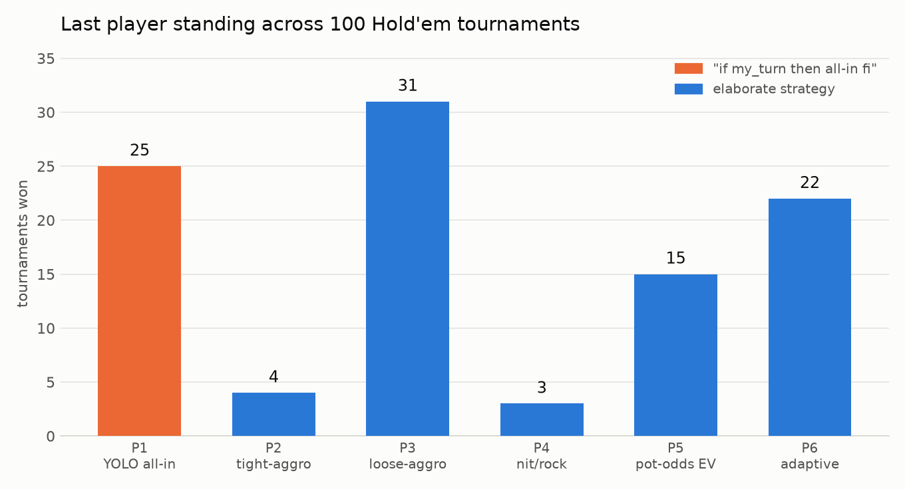

# Hold'em strategy showdown

Six-player no-limit Texas Hold'em tournament simulator. Five seats run
elaborate strategies; seat 1 runs the entire strategy:

```
if my_turn
then bet = All in
fi
```

No player knows any other player's algorithm — strategies see only their own
cards, the board, bets, stacks, and the public actions they observe.

## The lineup

| Seat | Strategy | Idea |
|------|----------|------|
| P1 | YOLO all-in | shoves every single turn, no exceptions |
| P2 | tight-aggressive | narrow premium range, position-aware, value-bets hard, semi-bluffs draws |
| P3 | loose-aggressive | wide opens, light 3-bets, relentless c-bets, occasional pure bluffs |
| P4 | nit / rock | premiums only, folds to pressure, tries to blind-ladder to the win |
| P5 | pot-odds EV | equity-vs-price machine with an M-ratio push-fold gear when short |
| P6 | adaptive profiler | tracks observed shove/aggression rates per opponent and re-ranges accordingly |

## The engine

- Full no-limit betting rounds (preflop/flop/turn/river), min-raise enforcement,
  all-ins, **side pots**, uncalled-bet refunds.
- 7-card hand evaluation (best 5 of 21 combinations), wheel straights included.
- 1,000 starting chips each; blinds start 10/20 and double every 10 hands, so
  every tournament terminates. Winner = last player with chips.
- One simplification vs. casino rules: a short all-in raise reopens the action.

Verified by fuzzing ~20k random hands for chip conservation and non-negative
stacks, plus evaluator unit checks (royal flush, wheel, quads, boat, kickers).

## Run it

```
python -m holdem.simulate --sims 100 --seed 42 --out holdem/winners.png
```

## Result (100 tournaments, seed 42)

```
P1 YOLO all-in   ████████████████████████████████          25  (25%)
P2 tight-aggro   █████                                      4  (4%)
P3 loose-aggro   ████████████████████████████████████████  31  (31%)
P4 nit/rock      ████                                       3  (3%)
P5 pot-odds EV   ███████████████████                       15  (15%)
P6 adaptive      ████████████████████████████              22  (22%)
```



The three-line monkey beats four of the five elaborate strategies' baseline —
uniform luck would give everyone ~17%, and the shover takes 25%. This is a
known real-poker phenomenon: in a winner-take-all format with fast blinds, a
maniac forces everyone to gamble for their tournament life every hand, and
tight strategies bleed out waiting for premiums that never come. Only the
players willing to fight back (the loose-aggressive brawler at 31% and the
adaptive profiler at 22%, which *learns* that seat 1 shoves any two cards and
starts calling wide) out-win the monkey.
