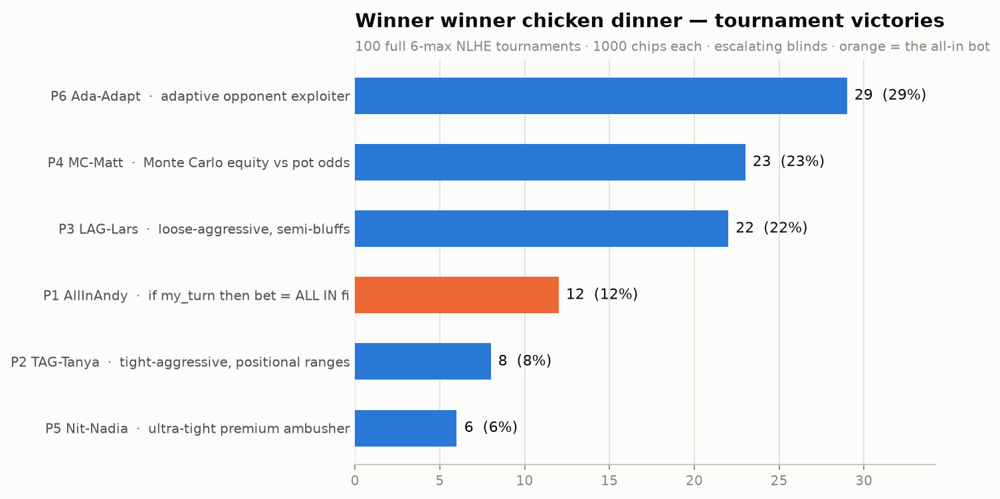

# holdem_sim — 6-max Texas Hold'em strategy battle royale

100 full no-limit Hold'em tournaments. Six bots, equal stacks (1000 chips),
escalating blinds, play until one player owns every chip. Nobody knows
anybody else's algorithm — each bot sees only its own hole cards and public
table information (board, pot, stacks, observable actions).

## The contenders

| Seat | Bot | Strategy |
|------|-----|----------|
| P1 | **AllInAndy** | `if my_turn then bet = All in fi` — that's it, that's the whole strategy |
| P2 | **TAG-Tanya** | Tight-aggressive: Chen-formula positional ranges, c-bets, value bets, pot-odds draws |
| P3 | **LAG-Lars** | Loose-aggressive: wide ranges, 3-bets, semi-bluffs every draw, random stabs |
| P4 | **MC-Matt** | Pure math: Monte Carlo equity rollouts vs live pot odds, no fear, no reads |
| P5 | **Nit-Nadia** | Ultra-tight survivalist: folds everything, ambush-shoves premiums |
| P6 | **Ada-Adapt** | Exploiter: profiles opponents live (all-in rate, fold rate) and adjusts calling/bluffing ranges |

## Results (100 tournaments, seed 42)

```
P1 AllInAndy  | #####################                               12  (12%)
P2 TAG-Tanya  | ##############                                       8  (8%)
P3 LAG-Lars   | ######################################              22  (22%)
P4 MC-Matt    | ########################################            23  (23%)
P5 Nit-Nadia  | ##########                                           6  (6%)
P6 Ada-Adapt  | ##################################################  29  (29%)
```



Baseline for a fair 6-player table is ~16.7% each. Verdict:

- **Ada-Adapt (29%)** wins the war: she notices Andy shoves 100% of hands and
  starts calling him off with any decent holding — free chips.
- **MC-Matt (23%)** and **LAG-Lars (22%)** beat baseline on raw aggression + equity.
- **AllInAndy (12%)** is below baseline but far from dead — max pressure steals
  a lot of blinds, and when he doubles up early he's terrifying.
- The tight bots got squeezed: **TAG-Tanya (8%)** and **Nit-Nadia (6%)** fold
  their way into blind-escalation oblivion at a table full of maniacs.

## Engine

- Real no-limit betting: raises, min-raise rules, all-ins, **side pots**
  (essential — an always-all-in player generates them constantly),
  uncalled-bet refunds, split pots.
- Full 7-card hand evaluator (straight flush → high card, wheel included).
- Blinds start 10/20 and double every 15 hands, so every tournament terminates.
- Verified: chips conserved and a single survivor across every simulated
  tournament.

## Run it

```bash
python3 simulate.py 100 42        # 100 tournaments, seed 42 → results.txt
python3 plot_results.py 100 42    # same + PNG histogram (needs matplotlib)
```
