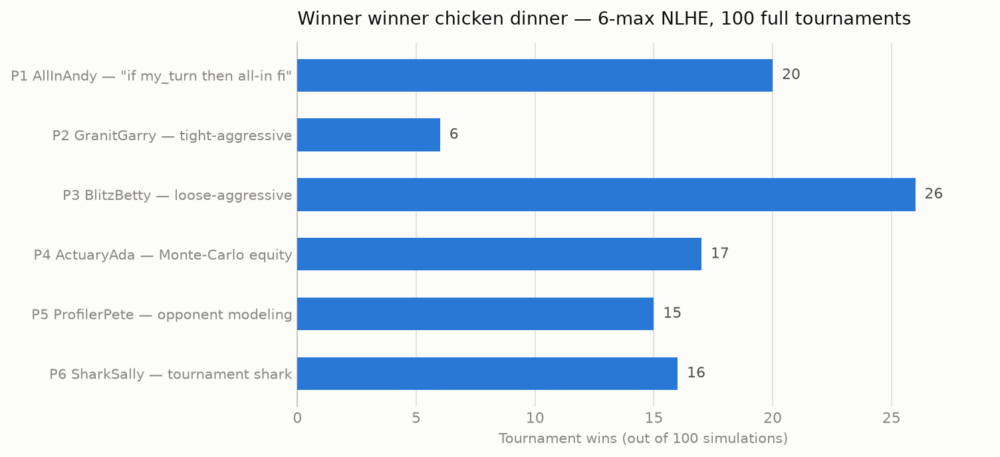

# holdem_sim — 6-max No-Limit Texas Hold'em tournament simulator

Six players, same starting stack (2000 chips), escalating blinds, full NLHE
rules: rotating button, four betting streets, all-ins, side pots, split pots,
eliminations. Nobody knows anybody else's algorithm — strategies only see
their own cards, the board, and publicly observable actions.

## The lineup

| Seat | Player | Strategy |
|------|--------|----------|
| 1 | **AllInAndy** | `if my_turn then bet = All in fi` — the whole thing |
| 2 | **GranitGarry** | Tight-aggressive: Chen-formula ranges tightened by position, disciplined value betting |
| 3 | **BlitzBetty** | Loose-aggressive: wide opens, 3-bet bluffs, c-bets, semi-bluffed draws, double barrels |
| 4 | **ActuaryAda** | Monte-Carlo equity vs pot odds on every single decision |
| 5 | **ProfilerPete** | Exploitative: profiles every opponent's public VPIP / aggression / all-in frequency and adjusts |
| 6 | **SharkSally** | Tournament specialist: M-ratio push/fold, positional steals, stack pressure |

## Run it

```bash
python3 simulate.py            # 100 tournaments, seed 42
python3 simulate.py 500        # more sims
python3 simulate.py 1 --seed 3 --verbose-first   # watch one tournament hand by hand
python3 plot_results.py        # render results.json -> winner_histogram.png
```

## Result (100 tournaments, seed 42)

```
P1-AllInAndy      20 (20.0%)
P2-GranitGarry     6 ( 6.0%)
P3-BlitzBetty     26 (26.0%)  <- champion
P4-ActuaryAda     17 (17.0%)
P5-ProfilerPete   15 (15.0%)
P6-SharkSally     16 (16.0%)
```



Notable: the one-line all-in bot beats four of the five elaborate strategies at
even money... it doesn't. It finishes second in *wins* because shoving every
hand converts maximum variance into first-or-busted outcomes — it steals blinds
uncontested until someone wakes up with a premium, then it's a coinflip for a
double-up or the rail. Fair odds would be 16.7% each; Andy's 20% is a small
edge bought entirely with variance, and BlitzBetty's relentless-but-selective
aggression beats it. GranitGarry's tight patience is the real loser here:
escalating blinds punish waiting for aces.

Files: `engine.py` (rules, betting, side pots, 7-card evaluator),
`strategies.py` (the six players), `simulate.py` (tournament runner + ASCII
histogram), `plot_results.py` (PNG chart), `results.json` (raw winners).
