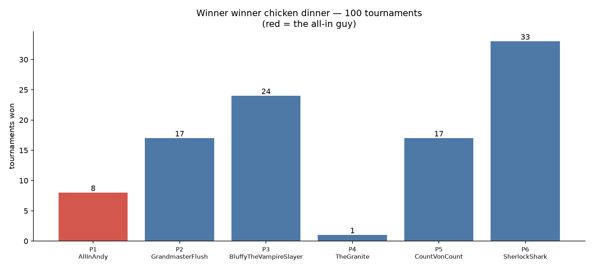

# Winner Winner Chicken Dinner — results

100 six-max no-limit hold'em tournaments, 1000 starting chips each, blinds 10/20 doubling every 15 hands, seed 42. 7586 hands dealt in total.

Player 1 runs the sacred text `if my_turn then bet = All in fi`. Players 2–6 run elaborate strategies. Nobody knows anybody else's algorithm.

## Championships

```
P1 AllInAndy                 ██████████                                 8  (8%)
P2 GrandmasterFlush          █████████████████████                     17  (17%)
P3 BluffyTheVampireSlayer    █████████████████████████████             24  (24%)
P4 TheGranite                █                                          1  (1%)
P5 CountVonCount             █████████████████████                     17  (17%)
P6 SherlockShark             ████████████████████████████████████████  33  (33%)
```

## Finishing positions

| player | championships | avg finish | best | worst |
|---|---|---|---|---|
| P1 AllInAndy | 8 | 5.04 | 1 | 6 |
| P2 GrandmasterFlush | 17 | 3.03 | 1 | 6 |
| P3 BluffyTheVampireSlayer | 24 | 3.71 | 1 | 6 |
| P4 TheGranite | 1 | 2.72 | 1 | 5 |
| P5 CountVonCount | 17 | 3.56 | 1 | 6 |
| P6 SherlockShark | 33 | 2.94 | 1 | 6 |


