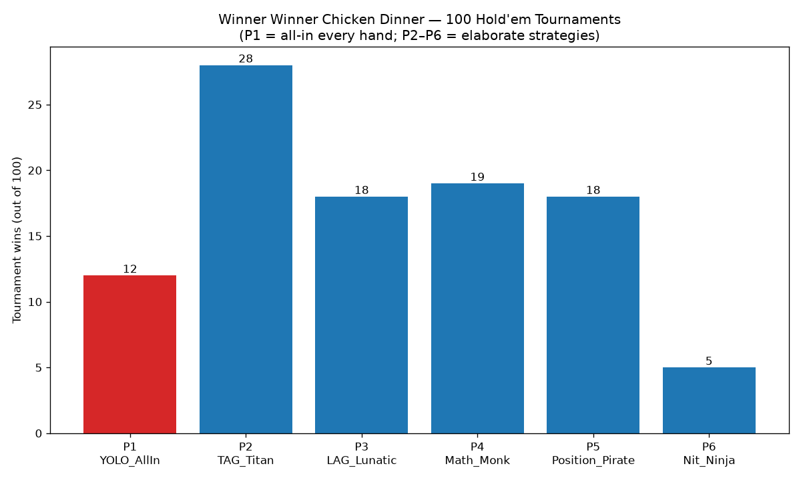

# Winner Winner Chicken Dinner — 100 Hold'em Tournaments

6 players, equal starting stacks (1000 chips), blinds 10/20 doubling every 25
hands, deterministic seeds 0–99. No strategy knows any other strategy exists.

- **P1 YOLO_AllIn** — the entire algorithm: `if my_turn then bet = All in fi`
- **P2 TAG_Titan** — tight-aggressive, Chen-formula ranges, equity value betting
- **P3 LAG_Lunatic** — loose-aggressive, bluffs, barrels, position-aware
- **P4 Math_Monk** — pure Monte-Carlo-equity-vs-pot-odds EV machine
- **P5 Position_Pirate** — nit early position, blind-stealing menace late
- **P6 Nit_Ninja** — premiums only, traps monsters, jams when it plays

## Histogram (tournament wins out of 100)

```
P1 YOLO_AllIn        12 |████████████
P2 TAG_Titan         28 |████████████████████████████
P3 LAG_Lunatic       18 |██████████████████
P4 Math_Monk         19 |███████████████████
P5 Position_Pirate   18 |██████████████████
P6 Nit_Ninja          5 |█████
```



## Takeaways

- **TAG wins the meta** (28/100): disciplined ranges + aggression is still king.
- **The YOLO all-in bot wins 12%** of tournaments — below the 16.7% random
  baseline but far from zero: it steals blinds relentlessly and doubles up
  whenever a caller's premium pair gets outdrawn. Variance is a strategy.
- **Nit_Ninja starves** (5/100): folding to escalating blinds is slow death,
  and when it finally jams QQ+, the YOLO bot has already flipped it out of
  the tournament half the time.
- Reproduce with `python3 holdem_sim.py` (seeds are fixed).
